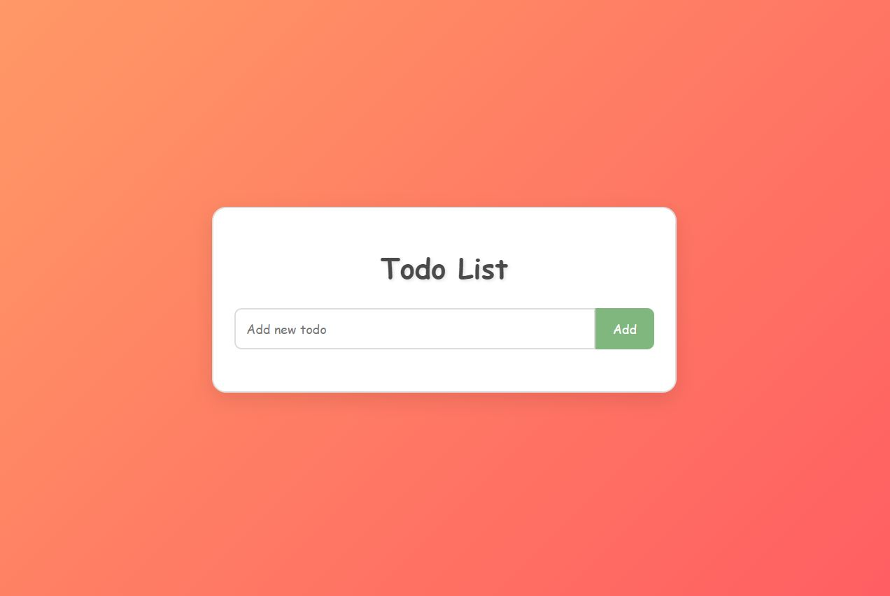

# Todo Application / Yapılacaklar Listesi Uygulaması

[English](#english) | [Türkçe](#türkçe)

## English

### Description

This is a simple, interactive Todo List application built with HTML, CSS, and JavaScript. It allows users to add, edit, delete, and mark tasks as completed.

### Features

- Add new tasks
- Edit existing tasks
- Delete tasks
- Mark tasks as completed by double-clicking
- Responsive design
- Smooth animations for better user experience

### Technologies Used

- HTML5
- CSS3
- JavaScript (ES6+)

### How to Use

1. Clone this repository to your local machine.
2. Open the `index.html` file in your web browser.
3. To add a new task, type in the input field and press Enter or click the "Add" button.
4. To edit a task, click the "Edit" button, make your changes, and click "Save".
5. To delete a task, click the "Delete" button.
6. To mark a task as completed, double-click on the task text.

### Project Structure

- `index.html`: The main HTML file
- `style.css`: Contains all the styles for the application
- `script.js`: Contains all the JavaScript functionality

### Future Improvements

- Add local storage to persist tasks
- Implement task categories or priorities
- Add due dates for tasks
- Create a dark mode option

---

## Türkçe

### Açıklama

Bu, HTML, CSS ve JavaScript kullanılarak oluşturulmuş basit, etkileşimli bir Yapılacaklar Listesi uygulamasıdır. Kullanıcıların görev eklemesine, düzenlemesine, silmesine ve tamamlandı olarak işaretlemesine olanak tanır.

### Özellikler

- Yeni görevler ekleme
- Mevcut görevleri düzenleme
- Görevleri silme
- Çift tıklayarak görevleri tamamlandı olarak işaretleme
- Duyarlı tasarım
- Daha iyi kullanıcı deneyimi için yumuşak animasyonlar

### Kullanılan Teknolojiler

- HTML5
- CSS3
- JavaScript (ES6+)

### Nasıl Kullanılır

1. Bu depoyu yerel makinenize klonlayın.
2. `index.html` dosyasını web tarayıcınızda açın.
3. Yeni bir görev eklemek için giriş alanına yazın ve Enter tuşuna basın veya "Add" düğmesine tıklayın.
4. Bir görevi düzenlemek için "Edit" düğmesine tıklayın, değişikliklerinizi yapın ve "Save" düğmesine tıklayın.
5. Bir görevi silmek için "Delete" düğmesine tıklayın.
6. Bir görevi tamamlandı olarak işaretlemek için görev metnine çift tıklayın.

### Proje Yapısı

- `index.html`: Ana HTML dosyası
- `style.css`: Uygulamanın tüm stillerini içerir
- `script.js`: Tüm JavaScript işlevselliğini içerir

### Gelecekteki İyileştirmeler

- Görevleri kalıcı hale getirmek için yerel depolama ekleme
- Görev kategorileri veya öncelikleri uygulama
- Görevler için son tarihler ekleme
- Karanlık mod seçeneği oluşturma
